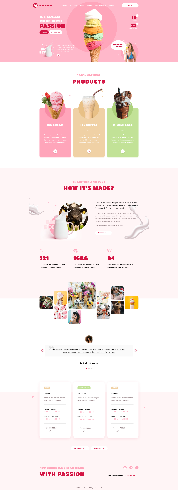
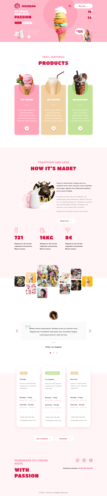
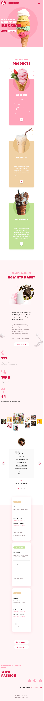

# Team projects that concludes the HTML and CSS/SCSS module

9 people had gathered to create a fully fledged professional website.

Adaptive layout. Parcel, teamwork, extensive Git practice. Implementation of various modal windows
using Javascript, external libraries for gallery images and a slider.

My role here was a Team Lead. Daily discussions, planning, controling the github commits,
fixing/finding errors, organizing files for the team.

Great experience, 10/10 would do it again :)

